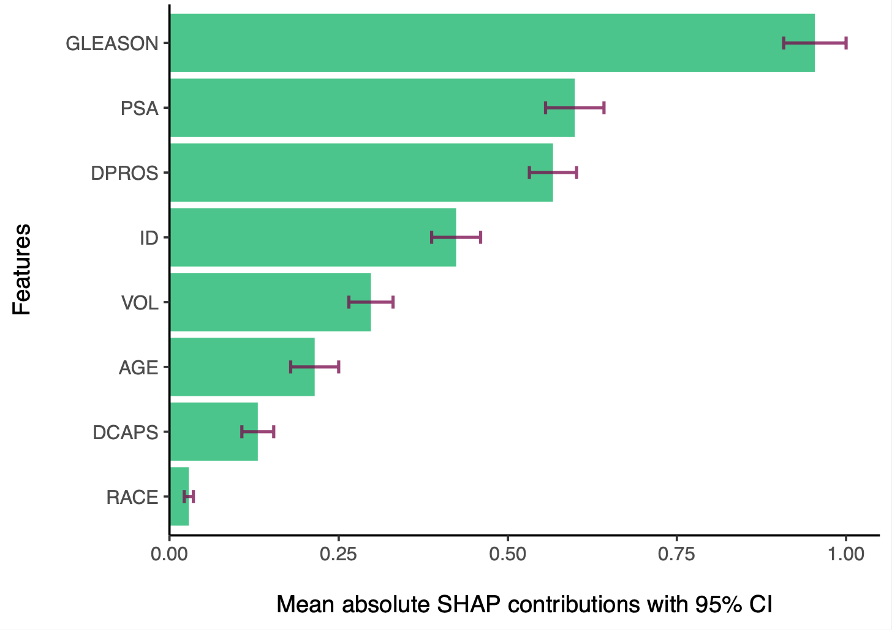
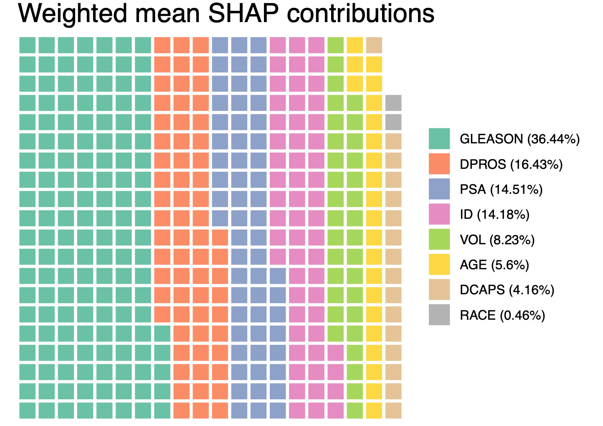
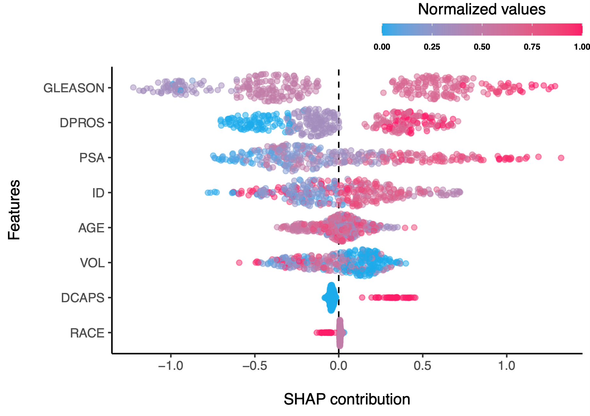
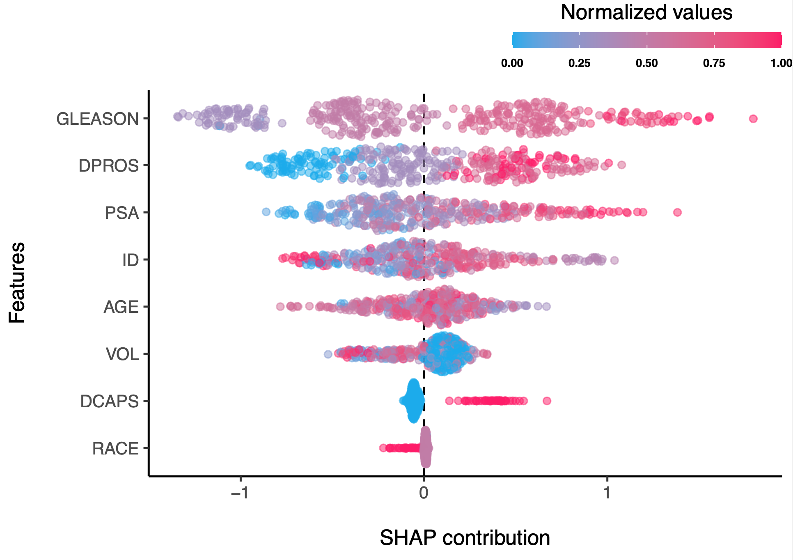
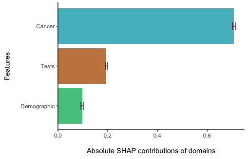
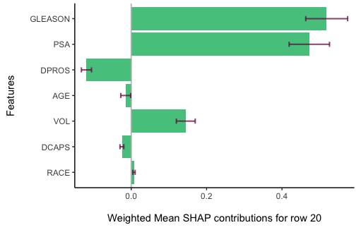

> - __Citation__: _Haghish, E. F. (2023). shapley: Weighted Mean SHAP for Feature Selection in ML Grid and Ensemble [computer software]_. URL: <https://CRAN.R-project.org/package=shapley>    
- - -


<a href="https://github.com/haghish/shapley"></a>
<br>
  
  __`shapley`__ : Weighted Mean SHAP for Feature Importance Assessment and Selection in Machine Learning Grid and Ensemble
================================================================================

[](https://cran.r-project.org/package=shapley)
[](https://cran.r-project.org/package=shapley) 
<!--
[](https://CRAN.R-project.org/package=shapley)
-->

## Introduction

The `shapley` R package addresses a significant limitation in machine learning research by providing a method to calculate the weighted mean and confidence intervals of __SHapley Additive exPlanations__, commonly known as __SHAP values__ across machine learning grids and stacked ensemble models. This approach enhances the stability and reliability of SHAP values, making the determination of important features more transparent and potentially more reproducible. Traditionally, the focus has been on reporting SHAP values from a single  'best' model, which can be problematic under conditions of severe class imbalance, where a universally accepted 'best' model may not exist. In addition, models with different parameters, might result in different evaluations of SHAP contributions and such variablity is also meaningful for researchers who wish to understand important features relevant to a model. In other words, SHAP values are unstable and varry across models, a limitation that is often overlooked in the literature by reporting the SHAP contributions of the 'best' model. In such scenarios, the SHAP values from a single model may not be representative of other models. The `shapley` package fills a critical gap by proposing methodology and enabling the computation of SHAP values for multiple machine learning models such as a fine-tuning grid search, and stacked ensemble models. This method computes weighted mean SHAP contributions, considering the performance of the model, to compute more stable SHAP values that also reflect of the variations across models. 

### Limitations in Current Machine Learning Research

In particular, the `shapley` software addresses the following shortcomings, often found in recent literature of applied machine learning:


1. The instability of SHAP values reported from single models is a concern, especially when the model's performance and the variability of SHAP values across multiple fine-tuned models are not taken into account. With the increase in  severity of class imbalance, the instability is expected to increase, because the definition of "best model" becomes less reliable due to lack of global performance metric that is not biased to class imbalance.  

2. There is an absence of standardized methods for calculating SHAP values for stacked ensemble models or for determining the SHAP contributions of features within the entirety of models resulting from a tuned grid search. 

3. There is a notable gap in methods for computing confidence intervals for SHAP values. Such intervals are necessary for significance testing to determine if one feature's importance is statistically greater than that of another. They also would reflect the variability between how different models reflect on SHAP values of different features. 

4. The practice of identifying "top features" often relies on an arbitrary selection of a predefined number of features, such as the top 10 or top 20, without a standard methodological approach. There is a need for a more transparent and automated procedure for quantifying and identifying important features in a model. 

### Solutions implemented in the `shapley` R package

The `shapley` R package computes the weighted average and confidence intervals of Shapley values from multiple machine learning models. By incorporating model performance metrics as weights, it addresses the variability in SHAP values across different models, which is often overlooked when relying on a single "best" model. This approach is particularly valuable in situations where defining the best model is challenging, such as with severe class imbalances (class rarity, caused by low-prevalence outcome). The package also facilitates more reliable computation of SHAP contributions across models and provides a basis for significance testing between features to ensure differences are not due to random chance. Furthermore, the package proposes several automated and transparent methods for identifying important features. These methods use various metrics to define importance, allowing for the selection of significant features based on SHAP contributions without pre-specifying number of top features (see below for details).

## Examples

To demonstrate how __`shapley`__ can compute SHAP values across a machine learning grid, let's carry out a grid search to fine-tune Gradient Boosting Machines (GBM) algorithm for a binary classification. Next, I will use the grid to compute SHAP contributions across all models and report their weighted mean and weighted 95% confidence intervals. 

```r
library(h2o)            #shapley supports h2o models
library(shapley)

# initiate the h2o server
h2o.init(ignore_config = TRUE, nthreads = 2, bind_to_localhost = FALSE, insecure = TRUE)

# upload data to h2o cloud
prostate_path <- system.file("extdata", "prostate.csv", package = "h2o")
prostate <- h2o.importFile(path = prostate_path, header = TRUE)

# run AutoML to tune various models (GBM) for 60 seconds
y <- "CAPSULE"
prostate[,y] <- as.factor(prostate[,y])  #convert to factor for classification

set.seed(10)

#######################################################
### PREPARE H2O Grid (takes a couple of minutes)
#######################################################
# make sure equal number of "nfolds" is specified for different grids
grid <- h2o.grid(algorithm = "gbm", y = y, training_frame = prostate,
                 hyper_params = list(ntrees = seq(1,50,1)),
                 grid_id = "ensemble_grid",

                 # this setting ensures the models are comparable for building a meta learner
                 seed = 2023, fold_assignment = "Modulo", nfolds = 10,
                 keep_cross_validation_predictions = TRUE)

result <- shapley(grid, newdata = prostate, performance_metric = "aucpr", plot = TRUE)
```

In the example above, the `result` object would be a _list of class `shapley`_, which in cludes the information such as weighted mean and weighted confidence intervals as well as other metrics regarding SHAP contributions of different features. 

# Plotting SHAP values at multiple levels (subject, features, and domains)

You can use the __`shapley.plot`__ function to plot the SHAP contributions:

## Feature level

### Barplot of important features based on weighted mean SHAP values

1. To plot weighted mean SHAP contributions as well as weighted 95% confidence intervals, pass the `shapley object`, in this example, named `result`, and specify `"bar"`, to create a bar plot:

```r
shapley.plot(result, plot = "bar")
```



### Waffle plot of important features based on weighted mean SHAP values

Another type of plot, that is also useful for identifying important features is 
__`waffle`__ plot, by default showing any feature that at least has contributed 
0.25% to the overall explained SHAP values across features. 

```r
shapley.plot(result, plot = "waffle")
```



### SHAP contribution plot of important features based on weighted mean SHAP values

Another type of plot is __`shap`__ plot, which shows the SHAP contributions of each feature for each observation (subject, or row in the data). This plot is useful for identifying the direction of the effect of each feature on the outcome, improving the transparency of the model. What is noteworthy about the __`shap`__ plot is that it visualizes the weighted mean SHAP contributions across all models, while taking the performance of the models into account. Therefore, this plot is expected to provide more stable SHAP explanations that how different values of a feature affect the outcome. 

```r
shapley.plot(result, plot="shap")
```

> Note: the weighted mean SHAP contribution plot of observations is expected to more clearly differentiate between how different values of a feature affect the outcome. 

* Weighted mean SHAP contributions of all models from the tuning grid


> For instance, in the plot above, the effect of "GLEASON" feature on the outcome is more clearly differentiated between different values of the feature, compared to the plot of SHAP contributions of a _the best_ model, as shown below. As you see, subjects with very high SHAP values that are shown in the _best model_ below are not present in the plot of weighted mean SHAP contributions, meaning that different models did not agree on the effect of "GLEASON" feature on the outcome and thus, the voice of different models is taken into account, weighted by their performance metric. It is also evident that the SHAP contributions of the weighted mean SHAP model are more clearly demonstrate the relationship of the feature on the outcome. See for example, the 'DPROS' feature, where the SHAP values are somehow well-clustered in the weighted mean SHAP plot, indicating that collectively, the models clearly see a pattern between increased intensity of 'DPROS' with the outcome. 

* SHAP contributions of the best model


## Domain level

Weighted mean SHAP values and their confidence intervals can also be computed for __Factors__ (A group of items) or __Domains__ (A group of correlated or related factors presenting a domain). For both, the `domain` argument should be specified so that the software compute the contribution of a cluster of items. There is no difference between _Factors_ and _Domains_, because for either, they need to be defined as a group of features (variables / columns) in the dataset. 

```r
print(shapley.plot(shapley = result,
                   plot = "bar", method = "mean",
                   domains = list(Demographic = c("RACE", "AGE"),
                                  Cancer = c("VOL", "PSA", "GLEASON"),
                                  Tests = c("DPROS", "DCAPS")),
                   print = TRUE))

```



## Subject level

You can also compute weighted mean SHAP values for each subject (row) in the dataset. To do that, use the `shapley.row.plot` function. For example, to view the SHAP contributions and their confidence intervals for the 20th row in the dataset, type:

```r
shapley.row.plot(result, row_index = 20)
```




### Significance testing across features

The bar plot displays the weighted average and confidence intervals for the SHAP contributions of various features, implying whether differences between two features might be due to random variation. To further investigate the statistical significance of these differences, the `shapley.test` function can be employed. This function uses a permutation test, typically with a default of 5000 permutations, to assess significance. For instance, to determine if the observed difference in SHAP contributions between the "GLEASON" and "DPROS" features is not just a random occurrence, we would use this function.

```r
shapley.test(result, features = c("GLEASON", "DPROS"), n = 5000)
```
```
The difference between the two features is significant:
observed weighted mean Shapley difference = 150.014579392817 and p-value = 0
$mean_shapley_diff
[1] 150.0146

$p_value
[1] 0
```

However, if we check the difference between "PSA" and "ID" features, the difference is insignificant, although "PSA" has a slightly higher weighted mean SHAP contribution:

```r
shapley.test(result, features = c("PSA", "ID"), n = 5000)
```
```
The difference between the two features is not significant:
observed weighted mean Shapley difference =2.44791199071206 and p-value = 0.678
$mean_shapley_diff
[1] 2.447912

$p_value
[1] 0.678
```

> Note: the weighted confidence intervals showed in the bar plot do not apply any permutation test.

## Specifying number of top features

Traditionally, the selection of a set number of significant features based on the highest SHAP values varied across scientific publications, with some reporting the top 10, 15, or 20. This selection did not account for the variability between models and often was either an arbitrary number. Other papers reported feature importance of all features, which is not practical for large datasets, and also, doesn't consider if features with neglegible SHAP contributions are statistically significant, given the variability across models. However, the calculation of weighted means and 95% confidence intervals allows for a systematic approach to identify features that consistently contribute to the model, across different models. For instance, the default method in the `shapley` package considers features important if their lower bound of the weighted 95% confidence interval ("`lowerCI`") for relative mean SHAP value exceeds `0.01`. This means any feature with a stable relative contribution of at least 1% - relative to the feature with the highest SHAP - is deemed important. This method is also utilized in the `bar` plot, where features are ranked by their weighted mean SHAP values, and the cutoff is applied to the lower confidence interval. This threshold can be adjusted to "`mean`", which sets the cutoff for weighted means, disregarding model variability—although this is experimental and might not be best practice, because it overlooks the variablitity across models and only considers the weighted means. Another experimental criterion - that seems more plausible than the "`mean`" strategy is "`shapratio`", setting a cutoff for the minimum weighted mean SHAP value as a percentage of the total SHAP contributions from all features. This is demonstrated in the `waffle` plot, where features must contribute at least 0.5% to the overall weighted mean SHAP values to be selected.

Between the "`lowerCI`" and "`shapratio`" methods, each has merits and limitations. "`LowerCI`" addresses variability across models, while "`shapratio`" focuses on feature contribution variability. Implementing both could provide insight into their efficacy and alignment in practice. Future research should explore these methodologies further. 

In this regard, the package also suggests a function for testing different criteria. Currently, implementing only `lowerci` and `shapratio` criteria. following the examples above, the __`shapley.top`__ shows features that pass 
different criteria:

```r
# running shapley.top with defult values for the 'result' object
shapley.top(result, lowerci = 0.01, shapratio = 0.005)
```
```
  feature    lowerci   shapratio lowerCI_criteria shapratio_criteria
1     AGE 0.13241618 0.056009832             TRUE               TRUE
2   DCAPS 0.09566612 0.041606347             TRUE               TRUE
3   DPROS 0.39986992 0.164283698             TRUE               TRUE
4 GLEASON 0.89025073 0.364372706             TRUE               TRUE
5      ID 0.33566464 0.141787423             TRUE               TRUE
6     PSA 0.34900145 0.145052440             TRUE               TRUE
8     VOL 0.19571663 0.082300782             TRUE               TRUE
7    RACE 0.01079821 0.004586772             TRUE              FALSE
```

which shows the features that pass both or one of the criteria. There is, however, a need for further research to suggest optimal cutoff values or reach a better perspective that what aspects should be taken into consideration for suggesting optimal cutoff values. 

## SHAP contributions of Stacked Ensemble Models

Stacked ensemble models integrate multiple base learner models' predictions, assigning weights according to each base model's performance. The methodology implemented in `shapley` software employs a similar approach, calculating the weighted mean SHAP contributions for stacked ensemble models just as it would for a fine-tuned grid of models. The `shapley` function's `models` parameter automatically detects whether the input is an `h2o` grid or an `h2o` or `autoEnsemble` stacked ensemble, eliminating the need for users to identify the model object class. 

## Supported Machine Learning models

The package is compatible with machine learning grids or stacked ensemble models created using the [`h2o`](https://h2o.ai/blog/2022/shapley-values-a-gentle-introduction/) package, as well as the [`autoEnsemble`](https://cran.r-project.org/package=autoEnsemble) package in R.

## About the author

The methodology implemented in this software as well as the software itself was developed by [E.F. Haghish](https://github.com/haghish/), who is a researcher at Department of Psychology, University of Oslo, researching applications of machine learning for mental health. 

> __Twitter: [@haghish](https://twitter.com/Haghish)__
